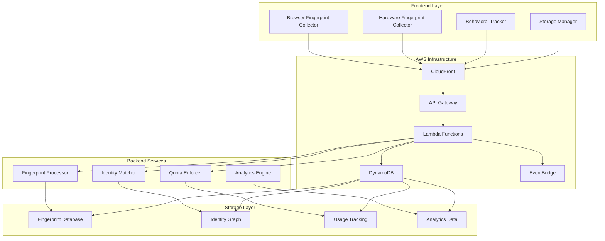

# Design Document

## Overview

The Advanced User Fingerprinting System is a comprehensive solution designed to accurately identify and track users across multiple devices, browsers, and sessions for quota enforcement in a GPU image generation service. The system combines multiple fingerprinting techniques, AWS infrastructure capabilities, and machine learning approaches to achieve high accuracy while maintaining legal compliance.

The system operates on a multi-layered approach:

1. **Frontend Fingerprint Collection** - Comprehensive browser and device data gathering
2. **Backend Processing & Analysis** - Server-side fingerprint analysis and correlation
3. **AWS Infrastructure Integration** - Leveraging CloudFront, API Gateway, and other AWS services
4. **Persistent Tracking** - Multiple storage mechanisms for identifier persistence
5. **Machine Learning Matching** - Statistical analysis for user identity correlation
6. **Quota Enforcement** - Integration with existing generation limits system

## Architecture

### High-Level Architecture



### Component Architecture

The system is built around several key components:

1. **Fingerprint Collection Service** - Frontend JavaScript library for comprehensive data gathering
2. **Fingerprint Processing Service** - Backend Lambda functions for analysis and storage
3. **Identity Resolution Service** - Machine learning-based user matching across sessions
4. **Quota Enforcement Service** - Integration with existing generation limits
5. **Analytics and Monitoring Service** - System performance and accuracy tracking

## Components and Interfaces

### Frontend Components

#### FingerprintCollector Class

```typescript
interface FingerprintCollector {
  collectBrowserFingerprint(): Promise<BrowserFingerprint>;
  collectHardwareFingerprint(): Promise<HardwareFingerprint>;
  collectBehavioralFingerprint(): Promise<BehavioralFingerprint>;
  collectNetworkFingerprint(): Promise<NetworkFingerprint>;
  generateCompositeFingerprint(): Promise<CompositeFingerprint>;
}

interface BrowserFingerprint {
  userAgent: string;
  language: string;
  languages: string[];
  timezone: string;
  screen: ScreenInfo;
  viewport: ViewportInfo;
  colorDepth: number;
  pixelRatio: number;
  cookiesEnabled: boolean;
  doNotTrack: string | null;
  plugins: PluginInfo[];
  fonts: string[];
  canvas: CanvasFingerprint;
  webgl: WebGLFingerprint;
  audio: AudioFingerprint;
}

interface HardwareFingerprint {
  cpuCores: number;
  memory: number;
  platform: string;
  architecture: string;
  gpu: GPUInfo;
  battery: BatteryInfo | null;
  deviceOrientation: DeviceOrientationInfo | null;
  touchSupport: TouchSupportInfo;
  mediaDevices: MediaDeviceInfo[];
}
```

#### PersistentStorage Class

```typescript
interface PersistentStorage {
  setIdentifier(key: string, value: string, type: StorageType): Promise<void>;
  getIdentifier(key: string, type: StorageType): Promise<string | null>;
  clearIdentifiers(): Promise<void>;
  resurrectIdentifiers(): Promise<Map<string, string>>;
}

enum StorageType {
  COOKIE = "cookie",
  LOCAL_STORAGE = "localStorage",
  SESSION_STORAGE = "sessionStorage",
  INDEXED_DB = "indexedDB",
  CACHE_API = "cacheAPI",
  SERVICE_WORKER = "serviceWorker",
  ETAG = "etag",
}
```

### Backend Components

#### FingerprintProcessor Service

```typescript
interface FingerprintProcessor {
  processFingerprint(
    fingerprint: CompositeFingerprint,
    metadata: RequestMetadata
  ): Promise<ProcessedFingerprint>;
  extractFeatures(fingerprint: CompositeFingerprint): Promise<FeatureVector>;
  calculateConfidenceScore(fingerprint: ProcessedFingerprint): Promise<number>;
  storeFingerprint(fingerprint: ProcessedFingerprint): Promise<string>;
}

interface ProcessedFingerprint {
  id: string;
  userId?: string;
  rawFingerprint: CompositeFingerprint;
  features: FeatureVector;
  confidence: number;
  timestamp: string;
  ipAddress: string;
  userAgent: string;
  cloudFrontHeaders: CloudFrontHeaders;
  apiGatewayMetadata: APIGatewayMetadata;
}
```

#### IdentityMatcher Service

```typescript
interface IdentityMatcher {
  findMatchingIdentities(
    fingerprint: ProcessedFingerprint
  ): Promise<IdentityMatch[]>;
  calculateSimilarity(
    fp1: ProcessedFingerprint,
    fp2: ProcessedFingerprint
  ): Promise<number>;
  consolidateIdentity(matches: IdentityMatch[]): Promise<ConsolidatedIdentity>;
  updateIdentityGraph(identity: ConsolidatedIdentity): Promise<void>;
}

interface IdentityMatch {
  identityId: string;
  similarity: number;
  confidence: number;
  matchingFeatures: string[];
  lastSeen: string;
}

interface ConsolidatedIdentity {
  identityId: string;
  fingerprints: string[];
  confidence: number;
  firstSeen: string;
  lastSeen: string;
  deviceCount: number;
  browserCount: number;
  characteristics: IdentityCharacteristics;
}
```

#### QuotaEnforcer Service

```typescript
interface QuotaEnforcer {
  checkQuota(identityId: string, feature: string): Promise<QuotaStatus>;
  enforceQuota(
    identityId: string,
    feature: string,
    usage: number
  ): Promise<QuotaResult>;
  getUsageStats(identityId: string): Promise<UsageStats>;
  resetQuota(identityId: string, feature: string): Promise<void>;
}

interface QuotaStatus {
  allowed: boolean;
  remaining: number;
  resetTime: string;
  reason?: string;
}

interface QuotaResult {
  success: boolean;
  newUsage: number;
  remaining: number;
  reason?: string;
}
```

### AWS Integration Components

#### CloudFront Headers Extractor

```typescript
interface CloudFrontHeaders {
  country: string;
  region: string;
  city: string;
  latitude: number;
  longitude: number;
  timezone: string;
  isp: string;
  edgeLocation: string;
  requestId: string;
}
```

#### API Gateway Metadata Extractor

```typescript
interface APIGatewayMetadata {
  requestId: string;
  requestTime: string;
  requestTimeEpoch: number;
  sourceIp: string;
  userAgent: string;
  protocol: string;
  httpMethod: string;
  path: string;
  headers: Record<string, string>;
  queryStringParameters: Record<string, string>;
}
```

## Data Models

### Fingerprint Storage Schema

#### FingerprintEntity (DynamoDB)

```typescript
interface FingerprintEntity {
  PK: string; // FINGERPRINT#{fingerprintId}
  SK: string; // METADATA
  GSI1PK: string; // IDENTITY#{identityId}
  GSI1SK: string; // {timestamp}#{fingerprintId}
  GSI2PK: string; // IP#{hashedIP}
  GSI2SK: string; // {timestamp}#{fingerprintId}
  GSI3PK: string; // USERAGENT#{hashedUserAgent}
  GSI3SK: string; // {timestamp}#{fingerprintId}

  fingerprintId: string;
  identityId?: string;
  rawFingerprint: CompositeFingerprint;
  features: FeatureVector;
  confidence: number;
  timestamp: string;
  ipAddress: string;
  hashedIP: string;
  userAgent: string;
  hashedUserAgent: string;
  cloudFrontData: CloudFrontHeaders;
  apiGatewayData: APIGatewayMetadata;
  ttl: number; // Auto-expire old fingerprints
}
```

#### IdentityEntity (DynamoDB)

```typescript
interface IdentityEntity {
  PK: string; // IDENTITY#{identityId}
  SK: string; // METADATA
  GSI1PK: string; // IDENTITY_ACTIVE
  GSI1SK: string; // {lastSeen}#{identityId}
  GSI2PK: string; // IDENTITY_CONFIDENCE
  GSI2SK: string; // {confidence}#{identityId}

  identityId: string;
  fingerprints: string[];
  confidence: number;
  firstSeen: string;
  lastSeen: string;
  deviceCount: number;
  browserCount: number;
  characteristics: IdentityCharacteristics;
  suspiciousActivity: boolean;
  notes: string[];
}
```

#### UsageTrackingEntity (DynamoDB)

```typescript
interface UsageTrackingEntity {
  PK: string; // USAGE#{identityId}
  SK: string; // {feature}#{period} // e.g., "generation#daily", "generation#monthly"
  GSI1PK: string; // USAGE_BY_FEATURE
  GSI1SK: string; // {feature}#{period}#{identityId}

  identityId: string;
  feature: string;
  period: string; // daily, monthly, weekly
  usage: number;
  limit: number;
  resetTime: string;
  lastUpdated: string;
}
```

### Feature Vector Structure

```typescript
interface FeatureVector {
  // Browser characteristics (normalized 0-1)
  browserFamily: number;
  browserVersion: number;
  osFamily: number;
  osVersion: number;

  // Hardware characteristics
  screenResolution: number;
  colorDepth: number;
  pixelRatio: number;
  cpuCores: number;
  memorySize: number;

  // Canvas/WebGL fingerprints (hashed and normalized)
  canvasHash: number;
  webglHash: number;
  audioHash: number;

  // Behavioral patterns
  timezoneOffset: number;
  languagePreference: number;
  pluginSignature: number;
  fontSignature: number;

  // Network characteristics
  connectionType: number;
  ipGeolocation: number;

  // Stability scores (how likely these features are to change)
  stabilityScore: number;
  uniquenessScore: number;
}
```

## Error Handling

### Fingerprint Collection Errors

- **Graceful Degradation**: If certain fingerprinting APIs fail, continue with available data
- **Fallback Mechanisms**: Use alternative methods when primary fingerprinting fails
- **Error Logging**: Comprehensive logging of collection failures for system improvement

### Processing Errors

- **Validation Errors**: Handle malformed fingerprint data gracefully
- **Storage Errors**: Implement retry mechanisms for database operations
- **Matching Errors**: Fallback to simpler matching algorithms if ML models fail

### Quota Enforcement Errors

- **Conservative Approach**: When in doubt, apply stricter limits
- **Audit Trail**: Log all quota decisions for review and appeals
- **Manual Override**: Admin interface for quota adjustments

## Testing Strategy

### Unit Testing

- **Fingerprint Collection**: Mock browser APIs and test data extraction
- **Feature Extraction**: Test mathematical transformations and normalizations
- **Identity Matching**: Test similarity algorithms with known datasets
- **Quota Enforcement**: Test limit calculations and enforcement logic

### Integration Testing

- **End-to-End Fingerprinting**: Test complete flow from collection to storage
- **Cross-Device Testing**: Verify identity matching across different devices
- **AWS Integration**: Test CloudFront and API Gateway data extraction
- **Database Operations**: Test DynamoDB queries and updates

### Performance Testing

- **Fingerprint Collection Speed**: Ensure minimal impact on page load
- **Processing Throughput**: Test backend processing under load
- **Database Performance**: Test query performance with large datasets
- **Memory Usage**: Monitor memory consumption in Lambda functions

### Accuracy Testing

- **Known User Testing**: Test with controlled user scenarios
- **False Positive Rate**: Measure incorrect identity matches
- **False Negative Rate**: Measure missed identity matches
- **Evasion Testing**: Test against common circumvention techniques

### Security Testing

- **Data Protection**: Ensure sensitive data is properly hashed/encrypted
- **Injection Attacks**: Test against malicious fingerprint data
- **Privacy Compliance**: Verify data handling meets legal requirements
- **Access Controls**: Test admin interfaces and data access permissions

## Implementation Phases

### Phase 1: Basic Fingerprinting (Weeks 1-2)

- Implement core browser fingerprint collection
- Set up basic backend processing and storage
- Create simple identity matching based on exact matches
- Integrate with existing quota system

### Phase 2: Enhanced Collection (Weeks 3-4)

- Add hardware fingerprinting capabilities
- Implement persistent storage mechanisms
- Add AWS infrastructure data collection
- Improve fingerprint processing algorithms

### Phase 3: Machine Learning Integration (Weeks 5-6)

- Implement feature vector extraction
- Create similarity matching algorithms
- Add behavioral pattern analysis
- Implement confidence scoring

### Phase 4: Advanced Features (Weeks 7-8)

- Add evasion detection and countermeasures
- Implement analytics and monitoring
- Create admin interfaces for system management
- Add performance optimizations

### Phase 5: Testing and Refinement (Weeks 9-10)

- Comprehensive testing across all scenarios
- Performance optimization and tuning
- Security auditing and compliance verification
- Documentation and deployment preparation

## Security and Privacy Considerations

### Data Protection

- **Hashing**: Sensitive identifiers are hashed before storage
- **Encryption**: All data encrypted in transit and at rest
- **Access Controls**: Strict IAM policies for data access
- **Data Retention**: Automatic expiration of old fingerprint data

### Privacy Compliance

- **Data Minimization**: Collect only necessary data for quota enforcement
- **Purpose Limitation**: Use data only for stated business purposes
- **Transparency**: Clear documentation of data collection and usage
- **User Rights**: Mechanisms for data access and deletion requests

### Security Measures

- **Input Validation**: Comprehensive validation of all fingerprint data
- **Rate Limiting**: Prevent abuse of fingerprinting endpoints
- **Monitoring**: Real-time monitoring for suspicious activities
- **Incident Response**: Procedures for handling security incidents

## Monitoring and Analytics

### System Metrics

- **Collection Success Rate**: Percentage of successful fingerprint collections
- **Processing Latency**: Time from collection to storage
- **Matching Accuracy**: Precision and recall of identity matching
- **Quota Enforcement Rate**: Percentage of quota violations detected

### Business Metrics

- **User Behavior**: Patterns in cross-device usage
- **Abuse Detection**: Frequency and types of quota violations
- **System Effectiveness**: Reduction in quota circumvention
- **Performance Impact**: Effect on user experience metrics

### Alerting

- **High Error Rates**: Alert when fingerprinting fails frequently
- **Suspicious Activity**: Alert on potential system gaming attempts
- **Performance Degradation**: Alert on slow processing times
- **Quota Anomalies**: Alert on unusual usage patterns
