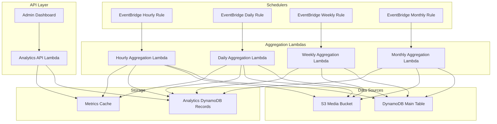

# PornSpot.ai Analytics Architecture

## Overview

This document describes the scalable and flexible analytics system for PornSpot.ai that enables tracking of platform metrics with pre-calculated aggregations at various time intervals.

## Architecture Components

### 1. Data Model

#### Analytics Entity Schema

```typescript
interface AnalyticsEntity extends BaseEntity {
  PK: string; // ANALYTICS#{metricType}#{granularity}
  SK: string; // {timestamp}
  GSI1PK: string; // ANALYTICS (reusing existing GSI1)
  GSI1SK: string; // {granularity}#{timestamp}#{metricType}
  GSI2PK: string; // ANALYTICS_TYPE#{metricType} (reusing existing GSI2)
  GSI2SK: string; // {timestamp}
  EntityType: "Analytics";

  // Core fields
  metricType: string; // e.g., "users", "media", "albums", "interactions"
  granularity: "hourly" | "daily" | "weekly" | "monthly";
  timestamp: string; // ISO 8601 timestamp (start of period)
  endTimestamp: string; // ISO 8601 timestamp (end of period)

  // Metric data (flexible JSON object for extensibility)
  metrics: {
    // User metrics
    totalUsers?: number;
    newUsers?: number;
    activeUsers?: number;

    // Media metrics
    totalMedia?: number;
    newMedia?: number;
    publicMedia?: number;
    privateMedia?: number;

    // Album metrics
    totalAlbums?: number;
    newAlbums?: number;
    publicAlbums?: number;
    privateAlbums?: number;

    // Interaction metrics
    totalLikes?: number;
    totalBookmarks?: number;
    totalComments?: number;
    totalViews?: number;

    // Generation metrics
    totalGenerations?: number;
    successfulGenerations?: number;
    failedGenerations?: number;

    // Additional metrics can be added here
    [key: string]: any;
  };

  // Metadata
  calculatedAt: string; // When this metric was calculated
  version: number; // Schema version for future migrations
}
```

#### Real-time Metrics Cache Entity (Optional)

```typescript
interface MetricsCacheEntity extends BaseEntity {
  PK: string; // METRICS_CACHE
  SK: string; // {metricKey}
  EntityType: "MetricsCache";

  metricKey: string; // e.g., "total_users", "total_media"
  value: number;
  lastUpdated: string;
  ttl: number; // DynamoDB TTL for cache expiration
}
```

### 2. Architecture Diagram



### 3. GSI Strategy (Cost-Optimized)

#### Reusing Existing GSIs - No New GSIs Needed!

We'll reuse existing GSIs efficiently without creating GSI8 or GSI9:

1. **Analytics Storage Using Existing GSIs**

   - **Main Table**: PK: `ANALYTICS#{metricType}#{granularity}`, SK: `{timestamp}`
   - **GSI1**: GSI1PK: `ANALYTICS`, GSI1SK: `{granularity}#{timestamp}#{metricType}`
     - Purpose: Query all metrics for a time range
   - **GSI2**: GSI2PK: `ANALYTICS_TYPE#{metricType}`, GSI2SK: `{timestamp}`
     - Purpose: Query specific metric type across time

2. **For Data Collection (counting items):**

   - **GSI1**: Already used for albums (PK: ALBUM)
   - **GSI2**: Already used for media (PK: MEDIA_ID)
   - **GSI3**: Already used for users (PK: USER_USERNAME)
   - **GSI7**: For content by date (PK: CONTENT) - tracks new items

3. **Cost Savings:**
   - No new GSIs = save ~$0.25-0.50/GB/month per GSI
   - Reuse existing indexes = no additional storage overhead
   - Lower operational complexity

### 4. Lambda Functions

#### 4.1 Hourly Aggregation Lambda

```
backend/functions/analytics/aggregate-hourly.ts
```

- Runs every hour
- Calculates metrics for the previous hour
- Stores in DynamoDB with granularity="hourly"

#### 4.2 Daily Aggregation Lambda

```
backend/functions/analytics/aggregate-daily.ts
```

- Runs once per day at 00:05 UTC
- Aggregates hourly data or recalculates from source
- Stores in DynamoDB with granularity="daily"

#### 4.3 Weekly Aggregation Lambda

```
backend/functions/analytics/aggregate-weekly.ts
```

- Runs every Monday at 00:10 UTC
- Aggregates daily data for the previous week
- Stores in DynamoDB with granularity="weekly"

#### 4.4 Monthly Aggregation Lambda

```
backend/functions/analytics/aggregate-monthly.ts
```

- Runs on the 1st of each month at 00:15 UTC
- Aggregates daily data for the previous month
- Stores in DynamoDB with granularity="monthly"

#### 4.5 Analytics API Lambda

```
backend/functions/analytics/get-metrics.ts
```

- Retrieves pre-calculated metrics
- Supports filtering by:
  - Metric type
  - Granularity
  - Time range
  - Specific metrics

### 5. Metric Calculation Strategies

#### Total Counts (Point-in-time)

```typescript
// Example: Total registered users
const totalUsers = await dynamoDB.query({
  TableName: TABLE_NAME,
  IndexName: "GSI3",
  KeyConditionExpression: "GSI3PK = :pk",
  ExpressionAttributeValues: {
    ":pk": "USER_USERNAME",
  },
  Select: "COUNT",
});
```

#### New Items (Time-based)

```typescript
// Example: New users in the last hour
const newUsers = await dynamoDB.query({
  TableName: TABLE_NAME,
  IndexName: "GSI9", // New User Activity Index
  KeyConditionExpression: "PK = :pk AND SK BETWEEN :start AND :end",
  ExpressionAttributeValues: {
    ":pk": "USER_ACTIVITY",
    ":start": startTimestamp,
    ":end": endTimestamp,
  },
  Select: "COUNT",
});
```

### 6. Initial Metrics Implementation

#### Phase 1 Metrics

1. **User Metrics**

   - Total registered users
   - New users (hourly, daily, weekly, monthly)
   - Active users (based on lastActive field)

2. **Media Metrics**

   - Total generated media
   - New generated media (by time period)
   - Public vs private media counts
   - Media by status (processing, completed, failed)

3. **Album Metrics**

   - Total albums
   - New albums (by time period)
   - Public vs private albums

4. **Interaction Metrics**
   - Total likes/bookmarks/comments
   - New interactions (by time period)
   - Most engaged content

### 7. API Endpoints

```typescript
// Get metrics endpoint
GET /api/admin/analytics/metrics
Query Parameters:
  - metricType: string (required)
  - granularity: hourly|daily|weekly|monthly (required)
  - startDate: ISO 8601 date (required)
  - endDate: ISO 8601 date (required)
  - metrics: comma-separated list (optional)

// Get real-time stats (from cache)
GET /api/admin/analytics/realtime
Returns current counts from cache

// Trigger manual recalculation (admin only)
POST /api/admin/analytics/recalculate
Body:
  - metricType: string
  - granularity: string
  - startDate: ISO 8601 date
  - endDate: ISO 8601 date
```

### 8. Scheduling Configuration

EventBridge Rules (CloudFormation/SAM):

```yaml
HourlyAnalyticsRule:
  Type: AWS::Events::Rule
  Properties:
    ScheduleExpression: "rate(1 hour)"
    Targets:
      - Arn: !GetAtt HourlyAggregationLambda.Arn
        Id: HourlyAnalytics

DailyAnalyticsRule:
  Type: AWS::Events::Rule
  Properties:
    ScheduleExpression: "cron(5 0 * * ? *)"
    Targets:
      - Arn: !GetAtt DailyAggregationLambda.Arn
        Id: DailyAnalytics

WeeklyAnalyticsRule:
  Type: AWS::Events::Rule
  Properties:
    ScheduleExpression: "cron(10 0 ? * MON *)"
    Targets:
      - Arn: !GetAtt WeeklyAggregationLambda.Arn
        Id: WeeklyAnalytics

MonthlyAnalyticsRule:
  Type: AWS::Events::Rule
  Properties:
    ScheduleExpression: "cron(15 0 1 * ? *)"
    Targets:
      - Arn: !GetAtt MonthlyAggregationLambda.Arn
        Id: MonthlyAnalytics
```

### 9. Performance Optimizations

1. **Pre-aggregation**: All metrics are pre-calculated to avoid expensive queries
2. **Caching**: Real-time metrics cached with TTL
3. **Batch Processing**: Process multiple metrics in single Lambda execution
4. **Parallel Queries**: Use Promise.all() for concurrent DynamoDB queries
5. **Pagination**: Handle large datasets with pagination tokens
6. **Compression**: Store aggregated data in compressed format if needed

### 10. Extensibility

To add new metrics:

1. Update the `metrics` object in AnalyticsEntity interface
2. Add calculation logic in aggregation Lambda
3. No database schema changes required (flexible JSON structure)
4. Optionally add new GSI if needed for efficient queries

Example of adding a new metric:

```typescript
// In aggregation Lambda
metrics.storageUsedGB = await calculateStorageUsage();
metrics.averageGenerationTime = await calculateAvgGenerationTime();
```

### 11. Cost Optimization

1. **DynamoDB Costs**:

   - Use on-demand pricing for analytics table
   - Implement data retention policy (delete old granular data)
   - Keep hourly data for 30 days, daily for 1 year, monthly forever

2. **Lambda Costs**:

   - Optimize memory allocation (start with 512MB)
   - Use ARM architecture for Lambda functions
   - Implement early termination for no-change scenarios

3. **Storage Optimization**:
   - Compress large metric objects
   - Archive old data to S3 after retention period

### 12. Monitoring & Alerting

1. **CloudWatch Metrics**:

   - Lambda execution duration
   - DynamoDB throttling
   - Failed aggregations

2. **Alarms**:
   - Alert if aggregation fails
   - Alert if execution time exceeds threshold
   - Alert if costs exceed budget

### 13. Migration Strategy

For existing data:

1. Create backfill Lambda function
2. Process historical data in batches
3. Start with monthly aggregations, then weekly, daily, hourly
4. Run in off-peak hours to minimize impact

## Implementation Phases

### Phase 1: Core Infrastructure (Week 1)

- Create AnalyticsEntity schema
- Add required GSIs
- Implement hourly aggregation Lambda
- Create basic API endpoint

### Phase 2: Initial Metrics (Week 2)

- Implement user metrics
- Implement media metrics
- Add daily aggregation
- Create admin dashboard integration

### Phase 3: Extended Metrics (Week 3)

- Add album metrics
- Add interaction metrics
- Implement weekly/monthly aggregations
- Add caching layer

### Phase 4: Optimization & Testing (Week 4)

- Performance tuning
- Cost optimization
- Load testing
- Documentation

## Security Considerations

1. **Access Control**:

   - Analytics API requires admin authentication
   - Use IAM roles for Lambda functions
   - Encrypt sensitive metrics

2. **Data Privacy**:
   - Aggregate data only (no PII in analytics)
   - Implement data retention policies
   - Audit logging for all access

## Testing Strategy

1. **Unit Tests**:

   - Test metric calculation functions
   - Test data aggregation logic
   - Mock DynamoDB queries

2. **Integration Tests**:

   - Test end-to-end aggregation flow
   - Test API endpoints
   - Verify data accuracy

3. **Performance Tests**:
   - Load test with large datasets
   - Measure query performance
   - Test concurrent aggregations

## Conclusion

This analytics architecture provides:

- Scalable and flexible metric tracking
- Efficient pre-calculated aggregations
- Easy extensibility for new metrics
- Cost-effective implementation
- Real-time and historical data access

The system can grow with the platform's needs while maintaining performance and keeping costs under control.
