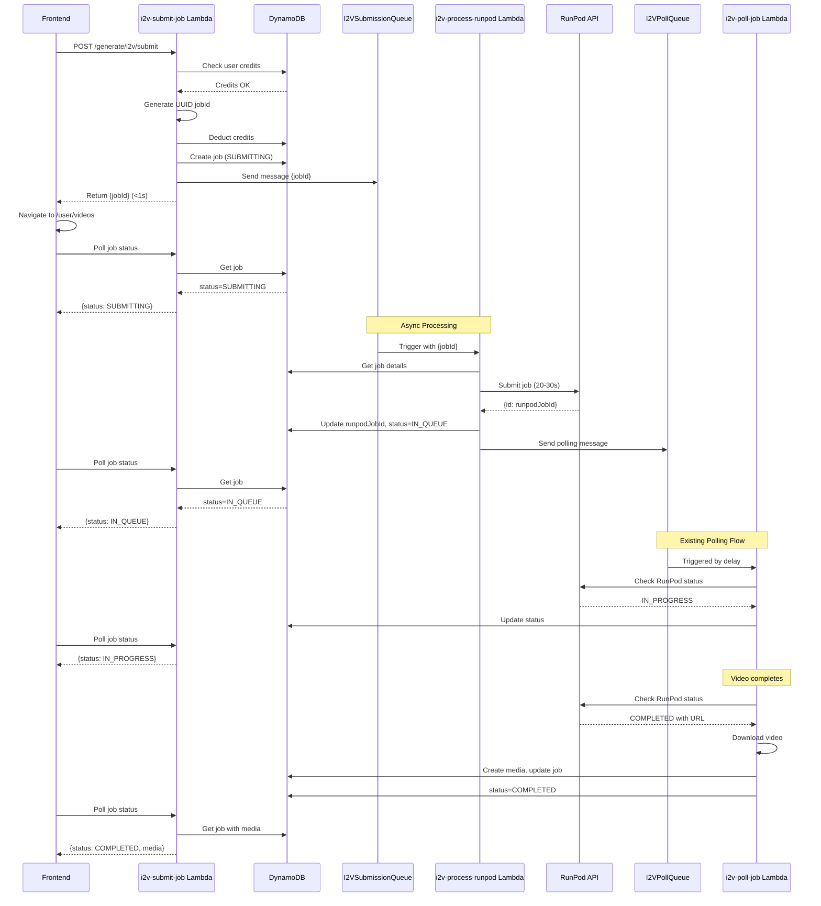
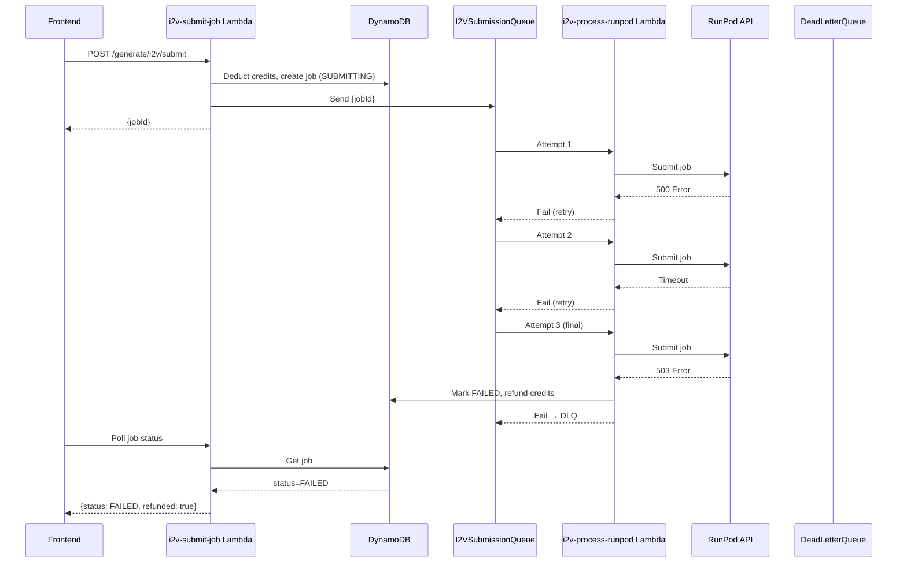
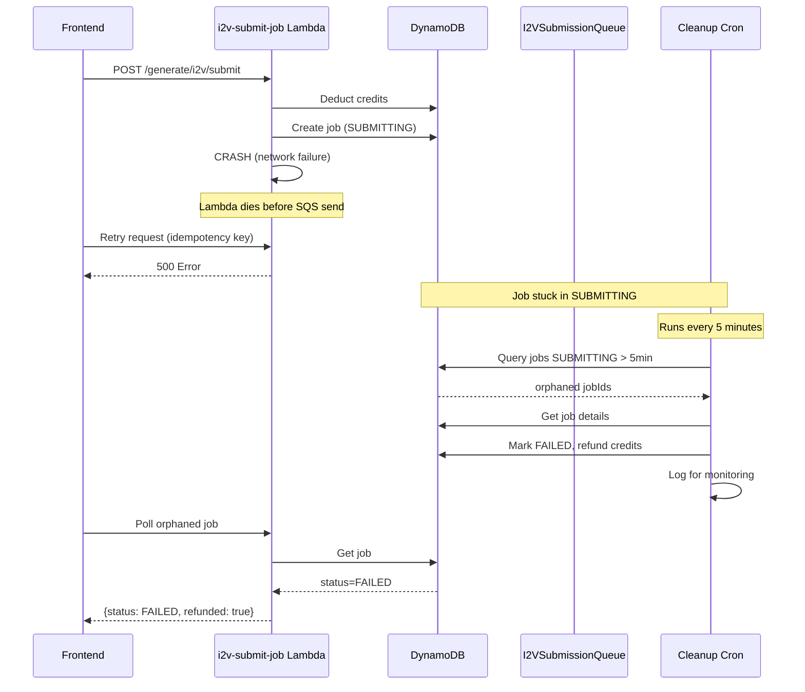

# I2V Async Job Submission Architecture

## Executive Summary

This document outlines the architecture for refactoring the i2v-submit-job Lambda from synchronous (blocking 20-30s for RunPod API) to asynchronous processing. The design enables immediate frontend navigation while maintaining data integrity and handling all failure scenarios.

**Key Objectives:**

- Reduce API response time from 20-30s to <1s
- Enable immediate frontend navigation to `/user/videos`
- Maintain credit deduction safety and refund logic
- Provide seamless migration with backward compatibility
- Handle all edge cases (crashes, timeouts, orphaned jobs)

---

## 1. Database Schema Changes

### 1.1 Current Schema (BEFORE)

```typescript
export interface I2VJobEntity extends BaseEntity {
  PK: string; // I2VJOB#{runpodJobId}  ← PROBLEM: Needs RunPod ID
  SK: string; // METADATA
  GSI1PK: string; // I2VJOB_BY_USER#{userId}
  GSI1SK: string; // {createdAt}#{jobId}
  GSI2PK: string; // I2VJOB_BY_MEDIA#{mediaId}
  GSI2SK: string; // {createdAt}#{jobId}
  GSI3PK: string; // I2VJOB_STATUS#{status}
  GSI3SK: string; // {createdAt}#{jobId}
  GSI4PK: string; // I2VJOB_STATUS_USER#{userId}#{status}
  GSI4SK: string; // {createdAt}#{jobId}

  jobId: string; // Same as RunPod ID
  userId: string;
  mediaId: string;
  status: "IN_QUEUE" | "IN_PROGRESS" | "COMPLETED" | "FAILED";
  // ... other fields
}
```

**Problem:** Primary key uses RunPod's job ID, requiring synchronous wait.

### 1.2 New Schema (AFTER)

```typescript
export interface I2VJobEntity extends BaseEntity {
  // PRIMARY KEY - Now uses pre-generated UUID
  PK: string; // I2VJOB#{jobId}  ← Pre-generated UUID
  SK: string; // METADATA

  // GSI Indexes (jobId references remain same structure)
  GSI1PK: string; // I2VJOB_BY_USER#{userId}
  GSI1SK: string; // {createdAt}#{jobId}
  GSI2PK: string; // I2VJOB_BY_MEDIA#{mediaId}
  GSI2SK: string; // {createdAt}#{jobId}
  GSI3PK: string; // I2VJOB_STATUS#{status}
  GSI3SK: string; // {createdAt}#{jobId}
  GSI4PK: string; // I2VJOB_STATUS_USER#{userId}#{status}
  GSI4SK: string; // {createdAt}#{jobId}

  // NEW: Separate GSI for RunPod ID lookups (if needed for debugging)
  GSI5PK?: string; // I2VJOB_BY_RUNPOD#{runpodJobId}
  GSI5SK?: string; // {createdAt}

  // Core identifiers
  jobId: string; // NEW: Pre-generated UUID (user-facing ID)
  runpodJobId?: string; // NEW: Separate field for RunPod's ID
  userId: string;
  mediaId: string;

  // NEW: Expanded status values
  status: "SUBMITTING" | "IN_QUEUE" | "IN_PROGRESS" | "COMPLETED" | "FAILED";

  // NEW: Submission tracking
  runpodSubmittedAt?: string; // When RunPod API was called
  runpodSubmissionAttempts?: number; // Retry counter
  lastSubmissionError?: string; // Last error from RunPod submission

  // Existing fields
  submittedAt: string; // When user submitted (immediate)
  updatedAt: string;
  completedAt?: string;
  // ... other existing fields
}
```

**Key Changes:**

1. `jobId`: Now a pre-generated UUID (created immediately)
2. `runpodJobId`: NEW field for RunPod's actual job ID
3. `PK`: Uses pre-generated `jobId` instead of RunPod ID
4. `status`: NEW "SUBMITTING" state for pre-RunPod phase
5. `GSI5`: Optional index for RunPod ID lookups (debugging)
6. Submission tracking fields for error handling

### 1.3 Status State Machine

```
SUBMITTING → IN_QUEUE → IN_PROGRESS → COMPLETED
    ↓
  FAILED (can occur from any state)
```

**Status Definitions:**

- `SUBMITTING`: Job created, credits deducted, awaiting RunPod submission
- `IN_QUEUE`: RunPod accepted, waiting in queue
- `IN_PROGRESS`: RunPod processing video generation
- `COMPLETED`: Video generated and downloaded
- `FAILED`: Job failed (with automatic refund)

### 1.4 Migration Strategy

**Backward Compatibility:**

- Old jobs: `PK = I2VJOB#{runpodJobId}` where `jobId === runpodJobId`
- New jobs: `PK = I2VJOB#{uuid}` where `jobId !== runpodJobId`

**Detection Logic:**

```typescript
function isLegacyJob(job: I2VJobEntity): boolean {
  return !job.runpodJobId || job.jobId === job.runpodJobId;
}
```

**No Data Migration Required:**

- Existing jobs continue working as-is
- New jobs use new schema
- Code handles both formats transparently

---

## 2. Lambda Function Architecture

### 2.1 Recommended: Hybrid Approach (Single Lambda with Async Invocation)

**Decision:** Modify existing `i2v-submit-job` Lambda to split into two phases using **SQS-triggered async processing**.

**Rationale:**

- ✅ Leverages existing SQS queue infrastructure
- ✅ Built-in retry and DLQ support
- ✅ Minimal new infrastructure
- ✅ Clear separation of concerns
- ✅ Easy rollback if issues

**Architecture:**

```
┌─────────────┐
│  Frontend   │
└──────┬──────┘
       │ POST /generate/i2v/submit
       ↓
┌──────────────────────────────────────┐
│   i2v-submit-job Lambda (Phase 1)    │ ~500ms
├──────────────────────────────────────┤
│ 1. Validate request                  │
│ 2. Check credits                     │
│ 3. Generate UUID jobId               │
│ 4. Deduct credits                    │
│ 5. Create job (status: SUBMITTING)   │
│ 6. Send to submission queue          │
│ 7. Return jobId immediately          │
└──────┬───────────────────────────────┘
       │
       │ ← Returns jobId in <1s
       ↓
┌─────────────┐
│  Frontend   │ Navigates to /user/videos
└─────────────┘ Starts polling jobId

       ↓ SQS Message
┌──────────────────────────────────────┐
│ I2VSubmissionQueue (NEW)             │
│ VisibilityTimeout: 120s              │
│ MaxReceiveCount: 3 → DLQ             │
└──────┬────────────────────────────────┘
       │ Triggers async
       ↓
┌──────────────────────────────────────┐
│ i2v-process-runpod Lambda (NEW)      │ 20-30s
├──────────────────────────────────────┤
│ 1. Retrieve job from DB              │
│ 2. Call RunPod API (20-30s wait)     │
│ 3. Update job with runpodJobId       │
│ 4. Update status to IN_QUEUE         │
│ 5. Send to polling queue             │
│ 6. Handle errors → refund credits    │
└──────┬───────────────────────────────┘
       │
       ↓ Success
┌──────────────────────────────────────┐
│  I2VPollQueue (EXISTING)             │
│  Triggers i2v-poll-job Lambda        │
└──────────────────────────────────────┘
```

### 2.2 Lambda Function Specifications

#### Lambda 1: `i2v-submit-job` (MODIFIED)

**File:** [`backend/functions/generation/i2v-submit-job.ts`](backend/functions/generation/i2v-submit-job.ts)

**Responsibilities:**

1. Request validation and user authentication
2. Credit balance verification
3. UUID generation for jobId
4. Optimistic credit deduction
5. Job entity creation (status: "SUBMITTING")
6. SQS message to I2VSubmissionQueue
7. Immediate response with jobId

**Key Changes:**

```typescript
// BEFORE: Waits for RunPod
const response = await fetch(runpodUrl, { ... });
const runpodResult = await response.json();
const jobId = runpodResult.id; // ← 20-30s wait

// AFTER: Generate UUID immediately
const jobId = uuidv4(); // ← Instant

const jobEntity: I2VJobEntity = {
  PK: `I2VJOB#${jobId}`,
  jobId,
  runpodJobId: undefined, // Not yet available
  status: "SUBMITTING",
  // ...
};

await DynamoDBService.createI2VJob(jobEntity);

// Send to submission queue for async processing
await sqs.sendMessage({
  QueueUrl: process.env.I2V_SUBMISSION_QUEUE_URL,
  MessageBody: JSON.stringify({ jobId }),
}).promise();

return ResponseUtil.success(event, { jobId });
```

**Timeout:** 30s (unchanged)
**Memory:** 256MB (unchanged)

#### Lambda 2: `i2v-process-runpod` (NEW)

**File:** `backend/functions/generation/i2v-process-runpod.ts` (NEW)

**Responsibilities:**

1. Receive SQS message with jobId
2. Retrieve job from DynamoDB
3. Call RunPod API (blocking 20-30s)
4. Update job with runpodJobId
5. Transition status: SUBMITTING → IN_QUEUE
6. Send to I2VPollQueue for monitoring
7. Handle failures (refund credits, mark FAILED)

**Pseudocode:**

```typescript
export const handler = async (event: SQSEvent) => {
  const records = event.Records;
  const failures: SQSBatchItemFailure[] = [];

  for (const record of records) {
    try {
      const { jobId } = JSON.parse(record.body);

      // Retrieve job
      const job = await DynamoDBService.getI2VJob(jobId);
      if (!job) {
        console.error(`Job ${jobId} not found`);
        continue; // Don't retry if job doesn't exist
      }

      // Idempotency check
      if (job.runpodJobId) {
        console.log(`Job ${jobId} already submitted to RunPod`);
        continue;
      }

      // Call RunPod API
      const runpodResponse = await callRunPodAPI(job);
      const runpodJobId = runpodResponse.id;

      // Update job
      await DynamoDBService.updateI2VJob(jobId, {
        runpodJobId,
        status: "IN_QUEUE",
        runpodSubmittedAt: new Date().toISOString(),
        runpodSubmissionAttempts: (job.runpodSubmissionAttempts || 0) + 1,
        updatedAt: new Date().toISOString(),
      });

      // Send to polling queue
      await sendToPollingQueue(jobId, job.estimatedSeconds);

      console.log(`Job ${jobId} submitted to RunPod: ${runpodJobId}`);
    } catch (error) {
      console.error(`Failed to process job:`, error);

      // Check retry count
      const approxReceiveCount = parseInt(
        record.attributes.ApproximateReceiveCount || "1"
      );

      if (approxReceiveCount >= 3) {
        // Final failure - refund credits and mark failed
        await handleFinalFailure(jobId, error);
      } else {
        // Retry
        failures.push({ itemIdentifier: record.messageId });
      }
    }
  }

  return { batchItemFailures: failures };
};

async function handleFinalFailure(jobId: string, error: any) {
  const job = await DynamoDBService.getI2VJob(jobId);
  if (!job) return;

  await DynamoDBService.updateI2VJob(jobId, {
    status: "FAILED",
    lastSubmissionError: error.message,
    completedAt: new Date().toISOString(),
    updatedAt: new Date().toISOString(),
  });

  // Refund credits
  const videoLength = job.request?.videoLength || 0;
  await DynamoDBService.refundI2VJobCredits(job, videoLength);

  console.log(`Job ${jobId} marked as FAILED after max retries`);
}
```

**Configuration:**

- **Timeout:** 90s (allow 30s RunPod + overhead)
- **Memory:** 256MB
- **Reserved Concurrency:** 10 (prevent RunPod API overload)
- **SQS Trigger:**
  - BatchSize: 1 (sequential processing)
  - MaxConcurrency: 10
  - VisibilityTimeout: 120s
  - MaxReceiveCount: 3

#### Lambda 3: `i2v-poll-job` (MINOR MODIFICATION)

**File:** [`backend/functions/generation/i2v-poll-job.ts`](backend/functions/generation/i2v-poll-job.ts)

**New Behavior for SUBMITTING status:**

```typescript
// Frontend polling
if (job.status === "SUBMITTING") {
  return ResponseUtil.success(event, {
    status: "SUBMITTING",
    message: "Job is being submitted to processing queue...",
    estimatedWaitTime: 30, // seconds
  });
}

// Existing logic for other statuses...
```

**No changes needed for SQS-triggered polls** - only triggers after IN_QUEUE status.

---

## 3. Complete Flow Diagrams

### 3.1 Happy Path Flow



### 3.2 RunPod Submission Failure Flow



### 3.3 Lambda Crash After Credit Deduction



---

## 4. Edge Cases & Error Handling

### 4.1 Orphaned Jobs (SUBMITTING Timeout)

**Scenario:** Lambda crashes after creating job but before sending to SQS.

**Detection:**

- Jobs in "SUBMITTING" status for >5 minutes

**Solution: Cleanup Cron Lambda**

```typescript
// New Lambda: i2v-cleanup-orphaned-jobs
// Triggered: EventBridge Cron every 5 minutes

export const handler = async () => {
  const fiveMinutesAgo = new Date(Date.now() - 5 * 60 * 1000).toISOString();

  const orphanedJobs = await DynamoDBService.queryJobsByStatus("SUBMITTING", {
    submittedBefore: fiveMinutesAgo,
  });

  for (const job of orphanedJobs) {
    console.warn(`Orphaned job detected: ${job.jobId}`);

    // Mark as failed and refund
    await DynamoDBService.updateI2VJob(job.jobId, {
      status: "FAILED",
      lastSubmissionError: "Submission timeout - orphaned job",
      completedAt: new Date().toISOString(),
    });

    await DynamoDBService.refundI2VJobCredits(
      job,
      job.request?.videoLength || 0
    );

    // Alert monitoring
    await logOrphanedJob(job);
  }
};
```

**Configuration:**

- **Schedule:** `rate(5 minutes)`
- **Timeout:** 60s
- **Memory:** 256MB

### 4.2 Duplicate Submission Prevention

**Scenario:** User refreshes page or double-clicks submit button.

**Solution: Idempotency Key**

```typescript
// Frontend includes idempotency key
const idempotencyKey = `i2v-${mediaId}-${Date.now()}`;

// Backend checks for existing submission
const existingJob = await findRecentJobByIdempotencyKey(
  userId,
  mediaId,
  idempotencyKey
);

if (existingJob) {
  return ResponseUtil.success(event, { jobId: existingJob.jobId });
}
```

**Alternative: Rate Limiting**

```typescript
// Check last submission time
const recentJob = await getLastJobByUser(userId);
if (recentJob && isWithinCooldown(recentJob.submittedAt, 30)) {
  return ResponseUtil.tooManyRequests(
    event,
    "Please wait before submitting again"
  );
}
```

### 4.3 RunPod Job ID Already Set

**Scenario:** Duplicate SQS message processing.

**Solution: Idempotency Check**

```typescript
const job = await DynamoDBService.getI2VJob(jobId);

if (job.runpodJobId) {
  console.log(`Job ${jobId} already has runpodJobId: ${job.runpodJobId}`);
  return; // Skip processing, not an error
}
```

### 4.4 Race Condition: Frontend Polls During Transition

**Scenario:** Frontend polls while status transitions from SUBMITTING → IN_QUEUE.

**Solution: Return Transitional Status**

```typescript
if (job.status === "SUBMITTING") {
  // Check if RunPod submission is in progress
  if (job.runpodSubmittedAt) {
    return {
      status: "SUBMITTING",
      message: "Processing your submission...",
      progress: "Awaiting queue confirmation",
    };
  }

  return {
    status: "SUBMITTING",
    message: "Preparing your video generation...",
    estimatedWaitTime: 30,
  };
}
```

### 4.5 Dead Letter Queue (DLQ) Monitoring

**Purpose:** Capture jobs that fail after max retries.

**Setup:**

```yaml
I2VSubmissionQueue:
  Type: AWS::SQS::Queue
  Properties:
    QueueName: !Sub "${Environment}-i2v-submission-queue"
    VisibilityTimeout: 120
    RedrivePolicy:
      deadLetterTargetArn: !GetAtt I2VSubmissionDLQ.Arn
      maxReceiveCount: 3

I2VSubmissionDLQ:
  Type: AWS::SQS::Queue
  Properties:
    QueueName: !Sub "${Environment}-i2v-submission-dlq"
    MessageRetentionPeriod: 1209600 # 14 days
```

**Monitoring:**

```typescript
// Lambda triggered by DLQ for alerting
export const handler = async (event: SQSEvent) => {
  for (const record of event.Records) {
    const { jobId } = JSON.parse(record.body);

    // Alert via CloudWatch/SNS
    await sendAlert({
      severity: "HIGH",
      message: `Job ${jobId} failed after max retries`,
      record,
    });
  }
};
```

---

## 5. Configuration Changes

### 5.1 template.yaml Updates

```yaml
# NEW: Submission Queue
I2VSubmissionQueue:
  Type: AWS::SQS::Queue
  Properties:
    QueueName: !Sub "${Environment}-i2v-submission-queue"
    VisibilityTimeout: 120
    RedrivePolicy:
      deadLetterTargetArn: !GetAtt I2VSubmissionDLQ.Arn
      maxReceiveCount: 3

I2VSubmissionDLQ:
  Type: AWS::SQS::Queue
  Properties:
    QueueName: !Sub "${Environment}-i2v-submission-dlq"
    MessageRetentionPeriod: 1209600

# MODIFIED: i2v-submit-job - Add SQS permission
I2VSubmitJobFunction:
  Properties:
    Environment:
      Variables:
        I2V_SUBMISSION_QUEUE_URL: !Ref I2VSubmissionQueue
    Policies:
      - Statement:
          - Effect: Allow
            Action:
              - sqs:SendMessage
            Resource:
              - !GetAtt I2VSubmissionQueue.Arn

# NEW: i2v-process-runpod Lambda
I2VProcessRunpodFunction:
  Type: AWS::Serverless::Function
  Properties:
    FunctionName: !Sub "${Environment}-pornspot-i2v-process-runpod-v1"
    PackageType: Image
    ImageUri: !Ref ImageUri
    ImageConfig:
      Command: ["functions/generation/i2v-process-runpod.handler"]
    Timeout: 90
    MemorySize: 256
    ReservedConcurrentExecutions: 10
    Environment:
      Variables:
        I2V_POLL_QUEUE_URL: !Ref I2VPollQueue
    Events:
      SubmissionQueue:
        Type: SQS
        Properties:
          Queue: !GetAtt I2VSubmissionQueue.Arn
          BatchSize: 1
          MaximumBatchingWindowInSeconds: 0
          FunctionResponseTypes:
            - ReportBatchItemFailures
    Policies:
      - DynamoDBCrudPolicy:
          TableName: !Ref MediaTable
      - Statement:
          - Effect: Allow
            Action:
              - ssm:GetParameter
            Resource:
              - !Sub "arn:aws:ssm:${AWS::Region}:${AWS::AccountId}:parameter/pornspot-ai/${Environment}/runpod-api-key"
          - Effect: Allow
            Action:
              - sqs:SendMessage
              - sqs:DeleteMessage
            Resource:
              - !GetAtt I2VPollQueue.Arn
              - !GetAtt I2VSubmissionQueue.Arn

# NEW: Cleanup orphaned jobs
I2VCleanupOrphanedFunction:
  Type: AWS::Serverless::Function
  Properties:
    FunctionName: !Sub "${Environment}-pornspot-i2v-cleanup-orphaned-v1"
    PackageType: Image
    ImageUri: !Ref ImageUri
    ImageConfig:
      Command: ["functions/generation/i2v-cleanup-orphaned.handler"]
    Timeout: 60
    MemorySize: 256
    Events:
      Schedule:
        Type: Schedule
        Properties:
          Schedule: rate(5 minutes)
          Enabled: true
    Policies:
      - DynamoDBCrudPolicy:
          TableName: !Ref MediaTable
```

### 5.2 Environment Variables

**New:**

- `I2V_SUBMISSION_QUEUE_URL`: URL for submission queue

**Existing (unchanged):**

- `I2V_POLL_QUEUE_URL`: URL for polling queue
- `RUNPOD_API_KEY`: From Parameter Store

---

## 6. Migration Plan

### 6.1 Deployment Phases

#### Phase 1: Schema Update (Low Risk)

**Goal:** Add new fields without breaking existing jobs.

**Steps:**

1. Update `I2VJobEntity` TypeScript interface
2. Update DynamoDB service methods to handle both schemas
3. Deploy Lambda updates (backward compatible)
4. **Validation:** Existing jobs continue working

**Rollback:** Simple code revert, no data migration needed

#### Phase 2: New Lambda Deployment (Medium Risk)

**Goal:** Deploy new submission processing lambda.

**Steps:**

1. Create `i2v-process-runpod.ts`
2. Create `i2v-cleanup-orphaned.ts`
3. Update `template.yaml` with new resources
4. Deploy stack update
5. **Validation:**
   - New SQS queue created
   - Lambdas deployed
   - No jobs in new queue yet

**Rollback:** Remove new resources, no impact on existing flow

#### Phase 3: Enable Async Flow (HIGH RISK)

**Goal:** Switch i2v-submit-job to async mode.

**Steps:**

1. Update `i2v-submit-job.ts` to use UUID and SQS
2. Deploy Lambda update
3. Enable monitoring dashboards
4. **Feature Flag:** `ENABLE_ASYNC_I2V_SUBMISSION=true`
5. **Gradual Rollout:** 10% → 50% → 100% traffic
6. **Validation:**
   - Monitor submission queue metrics
   - Track credit refund rates
   - Check orphaned job cleanup logs

**Rollback Strategy:**

```typescript
// Feature flag in code
const useAsyncSubmission = process.env.ENABLE_ASYNC_I2V_SUBMISSION === "true";

if (useAsyncSubmission) {
  // New async flow
  const jobId = uuidv4();
  await createJobAndSendToQueue(jobId);
} else {
  // Old synchronous flow
  const runpodResponse = await callRunPodAPI();
  const jobId = runpodResponse.id;
}

return ResponseUtil.success(event, { jobId });
```

**Monitoring During Rollout:**

- SQS queue depth (should remain low)
- Lambda error rates (i2v-process-runpod)
- Credit refund rate (should be <5%)
- Orphaned job count (should be ~0)
- Average submission latency (<1s target)

### 6.2 Backward Compatibility Testing

**Test Cases:**

1. **Legacy Job Access:**

   ```typescript
   // Old jobs where jobId === runpodJobId
   const legacyJob = await DynamoDBService.getI2VJob("rp-old-id-123");
   expect(legacyJob).toBeDefined();
   expect(legacyJob.jobId).toBe(legacyJob.runpodJobId);
   ```

2. **New Job Creation:**

   ```typescript
   const newJobId = uuidv4();
   const job = await createAsyncJob(newJobId);
   expect(job.jobId).not.toBe(job.runpodJobId);
   expect(job.status).toBe("SUBMITTING");
   ```

3. **Poll Handler Compatibility:**
   ```typescript
   // Should handle both legacy and new jobs
   const legacyResponse = await pollJob("rp-old-id");
   const newResponse = await pollJob("uuid-new-id");
   expect(legacyResponse.status).toBeDefined();
   expect(newResponse.status).toBeDefined();
   ```

### 6.3 Data Migration (OPTIONAL)

**If desired to unify schema:**

```typescript
// One-time migration script
async function migrateExistingJobs() {
  const allJobs = await scanAllI2VJobs();

  for (const job of allJobs) {
    if (!job.runpodJobId && job.jobId) {
      // Legacy job: populate runpodJobId
      await DynamoDBService.updateI2VJob(job.jobId, {
        runpodJobId: job.jobId, // Same as jobId
      });
    }
  }
}
```

**Decision:** Migration NOT required. System handles both formats transparently.

---

## 7. Risk Analysis & Mitigations

### 7.1 High-Risk Areas

| Risk                                    | Impact                | Probability | Mitigation                              |
| --------------------------------------- | --------------------- | ----------- | --------------------------------------- |
| **Credit Deduction Without Submission** | Users lose credits    | Medium      | Orphaned job cleanup + refund logic     |
| **SQS Queue Overload**                  | Delayed processing    | Low         | Reserved concurrency + monitoring       |
| **RunPod API Failures**                 | Failed generations    | Medium      | Retry logic + DLQ + auto-refund         |
| **Race Conditions on Status**           | Inconsistent UI state | Low         | Atomic DynamoDB updates + polling logic |
| **Lambda Timeout During Async**         | Stuck jobs            | Low         | Visibility timeout + cleanup cron       |
| **Duplicate Job Creation**              | Double charge         | Low         | Idempotency checks + rate limiting      |

### 7.2 Mitigation Strategies

**Credit Safety:**

- ✅ Credits deducted only AFTER validation
- ✅ Automatic refund on ALL failure paths
- ✅ Orphaned job cleanup (5-min scan)
- ✅ Manual refund tool for edge cases

**System Resilience:**

- ✅ SQS retries (3 attempts)
- ✅ DLQ for permanent failures
- ✅ Reserved concurrency prevents overload
- ✅ Feature flag for instant rollback

**Data Integrity:**

- ✅ Idempotent operations at all stages
- ✅ Conditional writes prevent conflicts
- ✅ Backward compatible schema
- ✅ No data loss during migration

---

## 8. Testing Strategy

### 8.1 Unit Tests

**i2v-submit-job.test.ts:**

```typescript
describe("Async Job Submission", () => {
  it("should generate UUID jobId immediately", async () => {
    const result = await submitJob(mockRequest);
    expect(result.jobId).toMatch(/^[0-9a-f-]{36}$/);
  });

  it("should create job in SUBMITTING status", async () => {
    const { jobId } = await submitJob(mockRequest);
    const job = await getJob(jobId);
    expect(job.status).toBe("SUBMITTING");
    expect(job.runpodJobId).toBeUndefined();
  });

  it("should deduct credits before SQS send", async () => {
    await submitJob({ videoLength: 10 });
    const user = await getUser(userId);
    expect(user.i2vCreditsSecondsFromPlan).toBe(initialCredits - 10);
  });

  it("should send message to submission queue", async () => {
    await submitJob(mockRequest);
    expect(sqsSendSpy).toHaveBeenCalledWith(
      expect.objectContaining({
        MessageBody: expect.stringContaining("jobId"),
      })
    );
  });
});
```

**i2v-process-runpod.test.ts:**

```typescript
describe("RunPod Processing", () => {
  it("should submit to RunPod and update job", async () => {
    await processRunpodSubmission(jobId);
    const job = await getJob(jobId);
    expect(job.runpodJobId).toBeDefined();
    expect(job.status).toBe("IN_QUEUE");
  });

  it("should handle RunPod API errors gracefully", async () => {
    mockRunpodAPI.mockRejectedValueOnce(new Error("503"));
    await expect(processRunpodSubmission(jobId)).rejects.toThrow();
  });

  it("should refund credits after max retries", async () => {
    // Simulate 3 failed attempts
    for (let i = 0; i < 3; i++) {
      await processWithFailure(jobId);
    }
    const job = await getJob(jobId);
    expect(job.status).toBe("FAILED");
    expect(job.refundedSeconds).toBe(job.request.videoLength);
  });

  it("should be idempotent for duplicate messages", async () => {
    await processRunpodSubmission(jobId);
    await processRunpodSubmission(jobId); // Duplicate
    const job = await getJob(jobId);
    expect(job.runpodSubmissionAttempts).toBe(1);
  });
});
```

### 8.2 Integration Tests

**End-to-End Flow:**

```typescript
describe("I2V Async Flow Integration", () => {
  it("should complete full async workflow", async () => {
    // 1. Submit job
    const { jobId } = await submitI2VJob({
      mediaId: "test-media",
      videoLength: 5,
    });

    // 2. Verify job created
    let job = await pollJob(jobId);
    expect(job.status).toBe("SUBMITTING");

    // 3. Wait for async processing
    await waitForSQSProcessing(2000);

    // 4. Verify RunPod submission
    job = await pollJob(jobId);
    expect(job.status).toBe("IN_QUEUE");
    expect(job.runpodJobId).toBeDefined();

    // 5. Mock RunPod completion
    await mockRunpodCompletion(job.runpodJobId);

    // 6. Trigger polling
    await triggerPollJob(jobId);

    // 7. Verify completion
    job = await pollJob(jobId);
    expect(job.status).toBe("COMPLETED");
    expect(job.resultMediaId).toBeDefined();
  });
});
```

### 8.3 Load Testing

**Scenarios:**

1. **Burst Submissions:** 100 concurrent job submissions
2. **Sustained Load:** 10 jobs/second for 5 minutes
3. **Failure Recovery:** Submit during RunPod outage

**Metrics to Monitor:**

- API response time (target: <1s)
- SQS queue depth (should drain quickly)
- Lambda concurrency usage
- Credit refund accuracy
- Error rates

---

## 9. Monitoring & Observability

### 9.1 CloudWatch Metrics

**Custom Metrics:**

```typescript
// Log custom metrics from Lambdas
await cloudwatch.putMetricData({
  Namespace: "PornSpotAI/I2V",
  MetricData: [
    {
      MetricName: "JobSubmissionLatency",
      Value: latencyMs,
      Unit: "Milliseconds",
    },
    {
      MetricName: "OrphanedJobsDetected",
      Value: orphanedCount,
      Unit: "Count",
    },
    {
      MetricName: "RunPodSubmissionFailures",
      Value: 1,
      Unit: "Count",
    },
  ],
});
```

**Dashboard Widgets:**

- Job submission rate (per minute)
- Average submission latency
- SQS queue depth (submission + polling)
- Lambda error rates by function
- Credit refund count (hourly)
- Orphaned job detection rate

### 9.2 Alarms

**Critical Alarms:**

```yaml
I2VOrphanedJobsAlarm:
  Type: AWS::CloudWatch::Alarm
  Properties:
    AlarmName: !Sub "${Environment}-i2v-orphaned-jobs-high"
    MetricName: OrphanedJobsDetected
    Namespace: PornSpotAI/I2V
    Statistic: Sum
    Period: 300
    EvaluationPeriods: 1
    Threshold: 5
    ComparisonOperator: GreaterThanThreshold
    AlarmActions:
      - !Ref AlertSNSTopic

I2VSubmissionQueueDepthAlarm:
  Type: AWS::CloudWatch::Alarm
  Properties:
    AlarmName: !Sub "${Environment}-i2v-submission-queue-depth"
    MetricName: ApproximateNumberOfMessagesVisible
    Namespace: AWS/SQS
    Dimensions:
      - Name: QueueName
        Value: !GetAtt I2VSubmissionQueue.QueueName
    Statistic: Average
    Period: 300
    EvaluationPeriods: 2
    Threshold: 50
    ComparisonOperator: GreaterThanThreshold
```

### 9.3 Logging Strategy

**Structured Logs:**

```typescript
// Consistent log format across all Lambdas
logger.info("Job submission started", {
  jobId,
  userId,
  mediaId,
  videoLength,
  timestamp: new Date().toISOString(),
});

logger.info("RunPod submission successful", {
  jobId,
  runpodJobId,
  latencyMs,
  attemptNumber,
});

logger.error("RunPod submission failed", {
  jobId,
  error: error.message,
  attemptNumber,
  willRetry: attemptNumber < 3,
});
```

**Log Insights Queries:**

```sql
-- Failed submissions by error type
fields @timestamp, jobId, error
| filter @message like /RunPod submission failed/
| stats count() by error
| sort count desc

-- Average submission latency
fields @timestamp, latencyMs
| filter @message like /RunPod submission successful/
| stats avg(latencyMs) as avgLatency by bin(5m)
```

---

## 10. Frontend Updates

### 10.1 API Response Changes

**BEFORE (Synchronous):**

```typescript
// Response after 20-30s
{
  jobId: "rp-abc123",
  status: "IN_QUEUE"
}
```

**AFTER (Async):**

```typescript
// Response in <1s
{
  jobId: "550e8400-e29b-41d4-a716-446655440000",
  status: "SUBMITTING"  // NEW status
}
```

### 10.2 Polling Updates

**Handle SUBMITTING Status:**

```tsx
// I2VPageContent.tsx
const statusMessage = {
  SUBMITTING: "Preparing your video generation...",
  IN_QUEUE: "Waiting in queue...",
  IN_PROGRESS: "Generating video...",
  COMPLETED: "Complete!",
  FAILED: "Generation failed",
};

const pollInterval = {
  SUBMITTING: 2000, // Poll every 2s during submission
  IN_QUEUE: 5000, // Poll every 5s when queued
  IN_PROGRESS: 10000, // Poll every 10s when processing
};
```

### 10.3 Error Handling

```tsx
if (response.status === "FAILED") {
  // Show error with refund confirmation
  setError(
    "Video generation failed. Your credits have been automatically refunded."
  );

  // Refresh user credits to show refund
  await queryClient.invalidateQueries(["user/profile"]);
}
```

---

## 11. Success Criteria

### 11.1 Performance Metrics

| Metric                    | Current | Target    | Must-Have |
| ------------------------- | ------- | --------- | --------- |
| API Response Time         | 20-30s  | <1s       | ✅        |
| Frontend Navigation       | Blocked | Immediate | ✅        |
| Credit Refund Rate        | ~2%     | <5%       | ✅        |
| Orphaned Jobs             | Unknown | <0.1%     | ✅        |
| RunPod Submission Success | ~95%    | >95%      | ✅        |

### 11.2 Validation Checklist

**Pre-Production:**

- [ ] All unit tests passing
- [ ] Integration tests passing
- [ ] Load testing completed
- [ ] Feature flag implemented
- [ ] Monitoring dashboards created
- [ ] Alarms configured
- [ ] DLQ alert setup
- [ ] Rollback procedure documented

**Production:**

- [ ] 10% traffic rollout successful
- [ ] No increase in credit refunds
- [ ] No orphaned jobs detected
- [ ] SQS queue depth normal
- [ ] Frontend navigation <1s
- [ ] 50% traffic rollout successful
- [ ] 100% traffic rollout successful

---

## 12. Summary & Recommendations

### 12.1 Key Benefits

✅ **User Experience:** Immediate navigation, no 20-30s wait
✅ **Scalability:** Async processing handles load spikes
✅ **Reliability:** Automatic retries + refunds + cleanup
✅ **Maintainability:** Feature flag enables instant rollback
✅ **Data Safety:** Credits always refunded on failure

### 12.2 Implementation Effort

**Estimated Timeline:**

- **Phase 1 (Schema):** 2-3 days
- **Phase 2 (New Lambdas):** 3-5 days
- **Phase 3 (Async Flow):** 2-3 days
- **Testing & Rollout:** 3-5 days
- **Total:** 10-16 days

**Resources Required:**

- 1 Backend Developer (primary)
- 1 DevOps Engineer (deployment)
- 1 QA Engineer (testing)

### 12.3 Recommended Approach

**Use the Hybrid SQS-Based Architecture:**

1. Minimal infrastructure changes (leverages existing SQS)
2. Built-in retry and DLQ support
3. Clear separation of concerns
4. Easy monitoring and debugging
5. Gradual rollout with feature flag

**Avoid:**

- ❌ Step Functions (overcomplicated for this use case)
- ❌ Lambda async invocation (no retry/DLQ built-in)
- ❌ Two separate API endpoints (confusing for frontend)

### 12.4 Next Steps

1. **Review & Approve** this architecture document
2. **Create** implementation tasks in project management
3. **Assign** developers to Phase 1 (schema updates)
4. **Schedule** deployment windows for each phase
5. **Prepare** monitoring dashboards before Phase 3
6. **Execute** phased rollout with careful monitoring

---

## Appendix

### A. File Changes Checklist

**New Files:**

- [ ] `backend/functions/generation/i2v-process-runpod.ts`
- [ ] `backend/functions/generation/i2v-cleanup-orphaned.ts`
- [ ] `backend/__tests__/generation/i2v-async.test.ts`

**Modified Files:**

- [ ] `shared-types/database.ts` (I2VJobEntity interface)
- [ ] `backend/functions/generation/i2v-submit-job.ts` (async flow)
- [ ] `backend/functions/generation/i2v-poll-job.ts` (SUBMITTING status)
- [ ] `backend/shared/utils/dynamodb.ts` (compatibility layer)
- [ ] `template.yaml` (new resources)
- [ ] `frontend/src/components/i2v/I2VPageContent.tsx` (status handling)

### B. Environment Variables

**Add to `template.yaml`:**

```yaml
I2V_SUBMISSION_QUEUE_URL: !Ref I2VSubmissionQueue
ENABLE_ASYNC_I2V_SUBMISSION: "false" # Feature flag
```

### C. Monitoring Queries

**Detect Stuck Jobs:**

```sql
fields @timestamp, jobId, status, submittedAt
| filter status = "SUBMITTING"
| filter submittedAt < @timestamp - 5m
```

**Track Refund Rate:**

```sql
fields @timestamp, jobId, refundedSeconds
| filter refundedSeconds > 0
| stats count() as refundCount by bin(1h)
```

---

**Document Version:** 1.0
**Last Updated:** 2025-11-05
**Author:** Architecture Team
**Status:** Ready for Implementation
